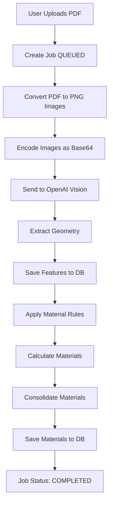

# 📘 GC Legacy - Complete Project Flow Documentation

## 🎯 Overview

GC Legacy is an AI-powered construction takeoff system that analyzes architectural/MEP plans and automatically generates material quantities for estimating.

**Technology Stack:**
- **Backend:** NestJS + TypeScript + Prisma ORM
- **Database:** PostgreSQL with PostGIS
- **AI:** OpenAI Vision API (GPT-5.1)
- **Frontend:** React + TypeScript + Vite
- **Deployment:** Render.com

---

## 🔄 Complete System Flow

### **Phase 1: Deployment (One Time)**


**What Happens:**
1. Code pushed to GitHub
2. Render detects changes
3. Runs build phase: `npx prisma generate` + `npm run build`
4. Runs deploy phase: `npx prisma migrate deploy`
5. Migrations create tables and insert default material rules
6. App starts and is ready to process PDFs

**Database State After Deployment:**
```sql
-- Tables created:
- files
- jobs
- sheets
- features
- materials
- materials_rule_sets  ← Contains "Standard Commercial Rules v1.0"
```

---

### **Phase 2: PDF Processing (Every Upload)**



---

## 📋 Step-by-Step Detailed Flow

### **Step 1: User Uploads PDF** 📤

**Frontend:**
```typescript
// File: frontend/src/components/PlanUpload.tsx
const formData = new FormData();
formData.append('file', pdfFile);

const response = await fetch('/v1/jobs', {
  method: 'POST',
  body: formData
});
```

**Backend:**
```typescript
// File: backend/src/modules/jobs/jobs.controller.ts
@Post()
async createJob(@Body() createJobDto: CreateJobDto) {
  // Creates job with status: QUEUED
  const job = await this.jobsService.createJob({
    fileId: uploadedFile.id,
    status: 'QUEUED',
    disciplines: ['architectural', 'plumbing', 'hvac', 'electrical']
  });
  
  // Triggers background processing
  await this.jobQueue.add('process-job', { jobId: job.id });
}
```

**Database State:**
```sql
INSERT INTO jobs (id, fileId, status, disciplines)
VALUES ('job123', 'file456', 'QUEUED', ['architectural', 'plumbing', 'hvac', 'electrical']);
```

---

### **Step 2: Convert PDF to Images** 🖼️

**Code:**
```typescript
// File: backend/src/modules/vision/plan-analysis.service.ts (line ~200)
const pdfBuffer = await this.filesService.downloadFile(fileId);

const rendered = await renderPdfToImages(pdfBuffer, {
  dpi: 75,           // Image resolution (75-300 DPI)
  maxPages: 100      // Maximum pages to process
});

// Result: Array of PNG image buffers
// [Buffer<page1.png>, Buffer<page2.png>, ...]
```

**Why PNG?**
- High quality for OpenAI Vision
- Lossless compression
- Better for line drawings than JPEG

**DPI Setting:**
- 75 DPI = Smaller files, faster processing, good quality
- 300 DPI = Larger files, slower, best quality
- Default: 75 (optimized for cost/performance)

---

### **Step 3: Encode Images as Base64** 🔐

**Code:**
```typescript
// File: backend/src/modules/vision/openai-vision.service.ts (line ~160)
const base64Image = imageBuffer.toString('base64');
const dataUrl = `data:image/png;base64,${base64Image}`;

// Example dataUrl:
// "data:image/png;base64,iVBORw0KGgoAAAANSUhEUgAA..."
```

**Why Base64?**
- OpenAI Vision API requires images as data URLs
- Embeds image directly in API request
- No need for separate image hosting

**Debug Mode:**
- If `SAVE_SAMPLE_IMAGES=true` in `.env`, saves first 3 images to `debug-images/` folder
- Helps verify image quality before sending to OpenAI

---

### **Step 4: Send to OpenAI Vision API** 🤖

**Code:**
```typescript
// File: backend/src/modules/vision/openai-vision.service.ts (line ~280)
const response = await this.openai.chat.completions.create({
  model: "gpt-5.1-2025-11-13",
  max_completion_tokens: 16000,
  response_format: {
    type: "json_schema",
    json_schema: {
      name: "PlanAnalysis",
      schema: PLAN_ANALYSIS_SCHEMA  // Defines expected JSON structure
    }
  },
  messages: [
    {
      role: "system",
      content: "You are an expert architectural plan analyzer..."
    },
    {
      role: "user",
      content: [
        { 
          type: "text", 
          text: "Analyze this floor plan and extract all rooms, walls, pipes..." 
        },
        { 
          type: "image_url", 
          image_url: { url: dataUrl }
        }
      ]
    }
  ]
});
```

**Prompt Strategy:**
- Instructs AI to trace visible geometry
- Provides scale detection guidance
- Requests structured JSON output
- Handles edge cases (unlabeled rooms, missing scales)

---

### **Step 5: OpenAI Vision Extracts Geometry** 🔍

**What OpenAI "Sees":**
- Room boundaries (polygons)
- Wall lines (polylines)
- Pipe runs (polylines with labels)
- Duct runs (polylines with sizes)
- Fixtures (points with symbols)
- Text labels and dimensions
- Scale bars

**Output Format:**
```json
{
  "rooms": [
    {
      "name": "SALES AREA",
      "polygon": [[10, 20], [50, 20], [50, 80], [10, 80]],
      "area": 2930.0,
      "units": "ft2"
    }
  ],
  "walls": [
    {
      "polyline": [[10, 20], [50, 20]],
      "length": 40.0,
      "partitionType": "PT-1"
    }
  ],
  "pipes": [
    {
      "polyline": [[5, 10], [15, 10], [15, 30]],
      "length": 30.0,
      "service": "CW",
      "diameterIn": 1.0
    }
  ],
  "ducts": [
    {
      "polyline": [[20, 5], [20, 40]],
      "length": 35.0,
      "size": "12x10"
    }
  ],
  "fixtures": [
    {
      "location": [25, 25],
      "fixtureType": "FD2",
      "count": 1
    }
  ],
  "scale": {
    "detected": true,
    "ratio": 48,
    "units": "ft"
  }
}
```

---

### **Step 6: Feature Types Explained** 📦

#### **1. ROOM Features** 🏠

**Contains:**
- `name`: Room label (e.g., "SALES AREA", "TOILET ROOM")
- `area`: Square footage
- `polygon`: Array of [x, y] coordinates defining room boundary
- `roomNumber`: Optional room number
- `program`: Optional program/use designation

**Example:**
```typescript
{
  id: "cmihy2nzv0017z6br43xmb5t9",
  jobId: "job123",
  sheetId: "sheet1",
  type: "ROOM",
  area: 2930.0,
  props: {
    name: "SALES AREA",
    roomNumber: "101",
    polygon: [[100, 200], [500, 200], [500, 800], [100, 800]]
  }
}
```

**Materials Generated:**
- VCT Flooring (based on area)
- Wall Paint (based on perimeter)
- ACT Ceiling Tiles (based on area)
- Rubber Base Molding (based on perimeter)

---

#### **2. WALL Features** 🧱

**Contains:**
- `length`: Linear feet of wall
- `polyline`: Array of [x, y] coordinates defining wall path
- `partitionType`: Wall type from drawings (PT-1, PT-2, etc.)
- `height`: Optional wall height

**Example:**
```typescript
{
  id: "wall789",
  jobId: "job123",
  sheetId: "sheet1",
  type: "WALL",
  length: 50.0,
  props: {
    partitionType: "PT-1",
    polyline: [[100, 200], [150, 200]]
  }
}
```

**Materials Generated:**
- Metal Studs (length × 0.75 for spacing)
- Gypsum Board (length × height × 2 sides ÷ 32 for 4×8 sheets)

---

#### **3. PIPE Features** 🚰

**Contains:**
- `length`: Linear feet of pipe run
- `polyline`: Array of [x, y] coordinates defining pipe path
- `service`: Pipe service type (CW=Cold Water, HW=Hot Water, SD=Storm Drain, etc.)
- `diameterIn`: Pipe diameter in inches

**Example:**
```typescript
{
  id: "pipe456",
  jobId: "job123",
  sheetId: "sheet2",
  type: "PIPE",
  length: 120.0,
  props: {
    service: "CW",
    diameterIn: 1.0,
    polyline: [[50, 100], [150, 100], [150, 300]]
  }
}
```

**Materials Generated:**
- Copper/PVC Pipe (based on service type and diameter)
- Fittings (couplings, elbows based on length)

---

#### **4. DUCT Features** 🌬️

**Contains:**
- `length`: Linear feet of duct run
- `polyline`: Array of [x, y] coordinates defining duct path
- `size`: Duct dimensions (e.g., "12x10" = 12" wide × 10" tall)

**Example:**
```typescript
{
  id: "duct123",
  jobId: "job123",
  sheetId: "sheet2",
  type: "DUCT",
  length: 80.0,
  props: {
    size: "12x10",
    polyline: [[200, 50], [200, 400]]
  }
}
```

**Materials Generated:**
- Galvanized Rectangular Ductwork
- Supply/Return Registers

---

#### **5. FIXTURE Features** 💡

**Contains:**
- `count`: Number of fixtures (usually 1)
- `location`: [x, y] coordinate of fixture
- `fixtureType`: Fixture designation from drawings (FD2, P1, etc.)

**Example:**
```typescript
{
  id: "fixture789",
  jobId: "job123",
  sheetId: "sheet3",
  type: "FIXTURE",
  count: 1,
  props: {
    fixtureType: "FD2",
    location: [250, 250]
  }
}
```

**Materials Generated:**
- LED Fixtures
- Switches
- Circuit breakers

---

#### **6. EQUIPMENT Features** ⚙️

**Contains:**
- `count`: Number of equipment units
- `location`: [x, y] coordinate
- `equipmentType`: Equipment tag (RTU-1, AHU-2, etc.)

**Example:**
```typescript
{
  id: "equip456",
  jobId: "job123",
  sheetId: "sheet4",
  type: "EQUIPMENT",
  count: 1,
  props: {
    equipmentType: "RTU-1",
    location: [300, 400]
  }
}
```

**Materials Generated:**
- HVAC units
- Controls
- Connections

---

### **Step 7: Save Features to Database** 💾

**Code:**
```typescript
// File: backend/src/modules/jobs/job.processor.ts (line ~280)
await this.jobsService.saveIngestResult(jobId, {
  sheets: [
    { index: 0, name: "Floor Plan - Level 1" }
  ],
  features: extractedFeatures  // 240 features from OpenAI
});
```

**Database State:**
```sql
-- features table now has 240 rows
SELECT type, COUNT(*) FROM features WHERE jobId = 'job123' GROUP BY type;

-- Results:
-- ROOM: 22
-- WALL: 105
-- PIPE: 45
-- DUCT: 30
-- FIXTURE: 38
```

---

### **Step 8: Load Material Rules** 📋

**Code:**
```typescript
// File: backend/src/modules/jobs/job.processor.ts (line ~850)
const ruleSetId = await this.getDefaultRuleSetId();
// Returns: "default-rules-v1"

const ruleSet = await prisma.materialsRuleSet.findUnique({
  where: { id: ruleSetId }
});

// ruleSet.rules contains:
{
  version: 1,
  vars: {
    vct_price: 3.85,
    waste_floor: 1.07,
    wall_height: 9,
    ...
  },
  rules: [
    { when: { feature: "room" }, materials: [...] },
    { when: { feature: "wall" }, materials: [...] },
    ...
  ]
}
```

**Where Rules Come From:**
- Created by migration `20251128012403_add_default_material_rules`
- Stored in `materials_rule_sets` table
- Contains 8 rules total (room, wall, pipe, duct)

---

### **Step 9: Apply Rules to Features** 🎯

**Code:**
```typescript
// File: backend/src/modules/rules-engine/rules-engine.service.ts (line ~100)
await this.rulesEngineService.applyRules(
  jobId,
  ruleSetId,
  features  // All 240 features
);
```

**How It Works:**

```typescript
// Pseudo-code for clarity
for (const feature of features) {
  // Find matching rule
  const rule = rules.find(r => r.when.feature === feature.type.toLowerCase());
  
  if (rule) {
    for (const materialDef of rule.materials) {
      // Evaluate quantity formula
      const qty = evaluateFormula(materialDef.qty, {
        area: feature.area,
        length: feature.length,
        count: feature.count,
        ...vars  // waste_floor, wall_height, etc.
      });
      
      materials.push({
        sku: materialDef.sku,
        qty: qty,
        description: materialDef.description,
        uom: materialDef.uom,
        featureId: feature.id
      });
    }
  }
}
```

**Example Calculation:**

Feature:
```typescript
{ 
  id: "room1", 
  type: "ROOM", 
  area: 2930.0 
}
```

Rule:
```json
{
  "when": { "feature": "room" },
  "materials": [
    {
      "sku": "ARM-EXCELON-51910",
      "qty": "area * waste_floor",
      "uom": "SF",
      "description": "Armstrong Excelon VCT Flooring"
    }
  ]
}
```

Calculation:
```javascript
qty = 2930 * 1.07 = 3,135 SF
```

Result:
```typescript
{
  sku: "ARM-EXCELON-51910",
  qty: 3135,
  uom: "SF",
  description: "Armstrong Excelon VCT Flooring",
  featureId: "room1"
}
```

---

### **Step 10: Consolidate Materials** 📊

**Problem:**
- 22 rooms × 4 materials each = 88 material items
- But we want 1 line item per SKU

**Solution:**
```typescript
// File: backend/src/modules/rules-engine/rules-engine.service.ts (line ~300)

// Group by SKU
const consolidated = {};

for (const item of materials) {
  if (!consolidated[item.sku]) {
    consolidated[item.sku] = {
      sku: item.sku,
      description: item.description,
      qty: 0,
      uom: item.uom,
      featureIds: []
    };
  }
  
  consolidated[item.sku].qty += item.qty;
  consolidated[item.sku].featureIds.push(item.featureId);
}

// Result: 12 unique SKUs (consolidated from ~1000 items)
```

**Example:**

Before consolidation:
```
ARM-EXCELON-51910: 3,135 SF (from room1)
ARM-EXCELON-51910: 1,124 SF (from room2)
ARM-EXCELON-51910: 1,247 SF (from room3)
... (22 items total)
```

After consolidation:
```
ARM-EXCELON-51910: 8,986 SF (from 22 rooms)
```

---

### **Step 11: Save Materials to Database** 💾

**Code:**
```typescript
// File: backend/src/modules/rules-engine/rules-engine.service.ts (line ~340)
await prisma.material.create({
  data: {
    jobId: jobId,
    sku: "ARM-EXCELON-51910",
    qty: 8986,
    uom: "SF",
    description: "Armstrong Excelon VCT Flooring",
    ruleId: "rule_room_flooring",
    sources: {
      features: ["room1", "room2", "room3", ...]  // All 22 room IDs
    }
  }
});
```

**Database State:**
```sql
SELECT sku, qty, uom, description FROM materials WHERE jobId = 'job123';

-- Results (12 rows):
-- ARM-EXCELON-51910    | 8,986  | SF  | Armstrong Excelon VCT Flooring
-- SW-7006-PAINT        | 8,153  | SF  | Sherwin Williams Paint
-- ARM-CIRRUS-ACT       | 9,435  | SF  | Armstrong ACT Ceiling Tiles
-- RUBBER-BASE-4IN      | 3,359  | LF  | 4-inch Rubber Base Molding
-- STUD-362-20GA        | 3,938  | LF  | Metal Studs 3-5/8" 20GA
-- GWB-58-TYPEX         | 1,476  | SHT | 5/8" Type X Gypsum Board
-- PIPE-COPPER-TYPEL    | 5,400  | LF  | Copper Pipe Type L
-- DUCT-GALV-RECT       | 2,400  | LF  | Galvanized Rectangular Ductwork
-- ... (4 more items)
```

---

### **Step 12: Job Completion** ✅

**Code:**
```typescript
// File: backend/src/modules/jobs/job.processor.ts (line ~900)
await this.jobsService.updateJob(jobId, {
  status: 'COMPLETED',
  finishedAt: new Date(),
  progress: 100
});
```

**Frontend Display:**
```typescript
// File: frontend/src/components/MaterialsList.tsx
const items = [
  {
    sku: "ARM-EXCELON-51910",
    description: "Armstrong Excelon VCT Flooring",
    qty: 8986,
    uom: "SF",
    price: 3.85,
    total: 34597.10,
    category: "Flooring",
    source: {
      features: ["Calculated from 22 rooms"]
    }
  }
];
```

---

## 📊 Database Schema Overview

### **jobs Table**
```sql
id              TEXT PRIMARY KEY
fileId          TEXT REFERENCES files(id)
status          JobStatus (QUEUED, PROCESSING, COMPLETED, FAILED)
disciplines     TEXT[]
materialsRuleSetId  TEXT REFERENCES materials_rule_sets(id)
progress        FLOAT (0-100)
startedAt       TIMESTAMP
finishedAt      TIMESTAMP
```

### **features Table**
```sql
id          TEXT PRIMARY KEY
jobId       TEXT REFERENCES jobs(id)
sheetId     TEXT REFERENCES sheets(id)
type        FeatureType (ROOM, WALL, PIPE, DUCT, FIXTURE, EQUIPMENT)
props       JSONB (name, polygon, length, service, etc.)
area        FLOAT
length      FLOAT
count       INTEGER
```

### **materials Table**
```sql
id          TEXT PRIMARY KEY
jobId       TEXT REFERENCES jobs(id)
sku         TEXT
description TEXT (Product description)
qty         FLOAT
uom         TEXT (Unit of measure: SF, LF, EA)
ruleId      TEXT
sources     JSONB ({ features: ["id1", "id2", ...] })
```

### **materials_rule_sets Table**
```sql
id          TEXT PRIMARY KEY
name        TEXT
version     TEXT
rules       JSONB (Complete rule definition)
createdAt   TIMESTAMP
updatedAt   TIMESTAMP

UNIQUE(name, version)
```

---

## 🎯 Material Rules Structure

### **Rule Set Format:**
```json
{
  "version": 1,
  "units": {
    "linear": "ft",
    "area": "ft2"
  },
  "vars": {
    "vct_price": 3.85,
    "waste_floor": 1.07,
    "waste_paint": 1.15,
    "wall_height": 9,
    "perimeter_ratio": 0.4
  },
  "rules": [
    {
      "when": { "feature": "room" },
      "materials": [
        {
          "sku": "ARM-EXCELON-51910",
          "qty": "area * waste_floor",
          "uom": "SF",
          "description": "Armstrong Excelon VCT Flooring"
        }
      ]
    }
  ]
}
```

### **Formula Variables:**
- `area`: Feature area in ft²
- `length`: Feature length in ft
- `count`: Number of items
- `waste_floor`: Waste factor (1.07 = 7% waste)
- `wall_height`: Assumed wall height
- `perimeter_ratio`: Area × 0.4 ≈ perimeter

### **Quantity Formulas:**
```javascript
// Flooring
qty = area * waste_floor
// Example: 2930 * 1.07 = 3,135 SF

// Wall Paint
qty = area * perimeter_ratio * waste_paint
// Example: 2930 * 0.4 * 1.15 = 1,348 SF

// Metal Studs
qty = length * 0.75
// Example: 50 * 0.75 = 37.5 LF (studs @ 16" o.c.)

// Gypsum Board
qty = length * wall_height * 2 / 32
// Example: 50 * 9 * 2 / 32 = 28 sheets (both sides)
```

---

## 🔧 Configuration & Environment Variables

### **Development (`backend/.env`):**
```bash
# Database
DATABASE_URL="postgresql://user@localhost:5432/plantakeoff"

# Redis
REDIS_HOST="localhost"
REDIS_PORT=6379

# OpenAI
OPENAI_API_KEY="sk-..."

# PDF Processing
PDF_RENDER_DPI=75              # Image quality (75-300)
PDF_RENDER_MAX_PAGES=100       # Max pages to process

# Vision API
VISION_BATCH_SIZE=5            # Parallel requests
OPENAI_MAX_TOKENS=16000        # Response length

# Debug (Development only - DO NOT set in production)
SAVE_SAMPLE_IMAGES=false       # Save first 3 images
SAVE_HTML_TEST=false           # Save base64 HTML tests
VALIDATE_BASE64=false          # Log base64 validation

# Environment
NODE_ENV=development
```

### **Production (Render Dashboard):**
```bash
# REQUIRED
NODE_ENV=production            # ⚠️ CRITICAL - Disables debug code
DATABASE_URL=postgresql://...  # From Render PostgreSQL service
REDIS_HOST=...                 # From Render Redis service
OPENAI_API_KEY=sk-...

# OPTIONAL
PDF_RENDER_DPI=75
VISION_BATCH_SIZE=5
OPENAI_MAX_TOKENS=16000

# DO NOT SET (debug only):
# SAVE_SAMPLE_IMAGES
# SAVE_HTML_TEST
# VALIDATE_BASE64
```

---

## 🚀 Deployment Process

### **1. Build Phase:**
```bash
npm install
npx prisma generate    # Generate TypeScript client
npm run build          # Compile NestJS app
```

### **2. Deploy Phase:**
```bash
npx prisma migrate deploy
```

This applies migrations in order:
1. `20251112134239_migrations_talha` - Initial schema
2. `20251118190002_fix_features_geom` - Geometry fixes
3. `20251121061447_add_provenance_and_validation` - Add columns
4. `20251128012000_add_description_to_materials` - Add description field
5. `20251128012403_add_default_material_rules` - Insert default rules

### **3. Start:**
```bash
npm start  # Start NestJS app
```

---

## 🐛 Troubleshooting

### **Issue: "column description does not exist"**
**Cause:** Migration not applied  
**Fix:** Run `npx prisma migrate deploy` in Render shell

### **Issue: "No materials rule set available"**
**Cause:** Default rules not inserted  
**Fix:** Check migration `20251128012403_add_default_material_rules` applied

### **Issue: Materials list empty**
**Cause:** Rules engine not running or no matching features  
**Fix:** Check logs for "Applying rules" and feature counts

### **Issue: OpenAI returns empty geometry**
**Cause:** Poor image quality or unclear floor plan  
**Fix:** Increase `PDF_RENDER_DPI` or check PDF quality

### **Issue: "Rate limit exceeded"**
**Cause:** Too many OpenAI API requests  
**Fix:** Reduce `VISION_BATCH_SIZE` or add retry delays

---

## 📈 Performance Optimization

### **Current Settings:**
- DPI: 75 (balanced quality/speed)
- Batch Size: 5 (parallel API calls)
- Max Tokens: 16,000 (longer responses)

### **For Faster Processing:**
- Reduce DPI to 50-75
- Increase batch size to 10
- Process fewer pages

### **For Better Quality:**
- Increase DPI to 150-300
- Reduce batch size to 1-3
- Increase max tokens to 32,000

---

## 📚 Key Files Reference

### **Backend:**
- `src/modules/jobs/job.processor.ts` - Main job processing orchestration
- `src/modules/vision/plan-analysis.service.ts` - PDF to image conversion
- `src/modules/vision/openai-vision.service.ts` - OpenAI API integration
- `src/modules/rules-engine/rules-engine.service.ts` - Material calculation logic
- `src/modules/materials/materials.service.ts` - Materials API
- `prisma/schema.prisma` - Database schema
- `prisma/migrations/` - Database migrations

### **Frontend:**
- `src/components/PlanUpload.tsx` - PDF upload interface
- `src/components/JobProgress.tsx` - Job status display
- `src/components/TakeoffResults.tsx` - Feature list
- `src/components/MaterialsList.tsx` - Materials list
- `src/services/api.ts` - API client

---

## 🎓 Glossary

**Feature:** A detected element from the floor plan (room, wall, pipe, etc.)

**SKU:** Stock Keeping Unit - unique product identifier

**UOM:** Unit of Measure (SF = square feet, LF = linear feet, EA = each)

**Takeoff:** Quantity measurement from construction drawings

**Rule Set:** Collection of rules defining how to calculate materials from features

**Migration:** Database schema change with version control

**Base64:** Text encoding of binary data (images) for API transmission

**DPI:** Dots Per Inch - image resolution setting

**Consolidation:** Combining multiple material items with same SKU into one line item

---

## ✅ Summary

**Flow in 10 Steps:**
1. User uploads PDF
2. PDF → PNG images (75 DPI)
3. PNG → Base64 → OpenAI Vision API
4. OpenAI extracts geometry (rooms, walls, pipes, ducts, fixtures)
5. Save 240 features to database
6. Load material rules from database (created by migration)
7. Apply rules: Calculate materials for each feature
8. Consolidate materials (~1000 items → 12 unique SKUs)
9. Save materials to database
10. Job complete - user views materials list

**Key Concepts:**
- **Migration time:** Creates rule templates (once)
- **Runtime:** Generates materials using templates (every PDF)
- **Features:** Building elements extracted by AI
- **Materials:** Products calculated from features using rules
- **Consolidation:** Summing quantities for same SKU

**Production Ready:**
- ✅ Automatic migrations on deploy
- ✅ Debug code disabled in production
- ✅ Optimized image processing
- ✅ Proper error handling
- ✅ Feature-complete material takeoff system

---

**Last Updated:** November 28, 2024  
**Version:** 1.0  
**Author:** GC Legacy Team

